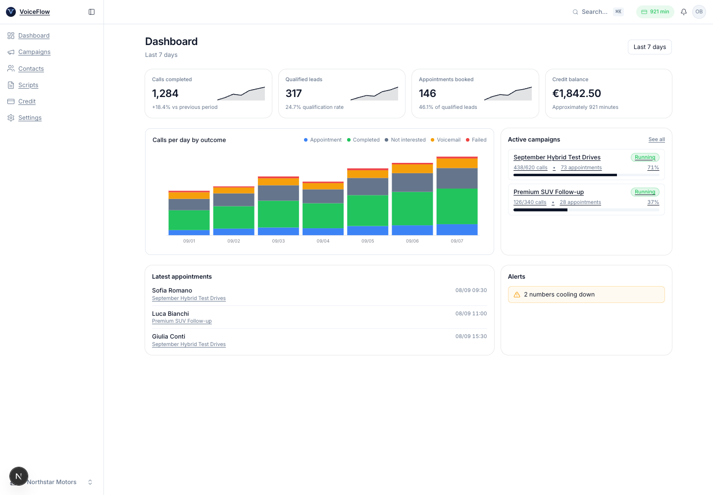
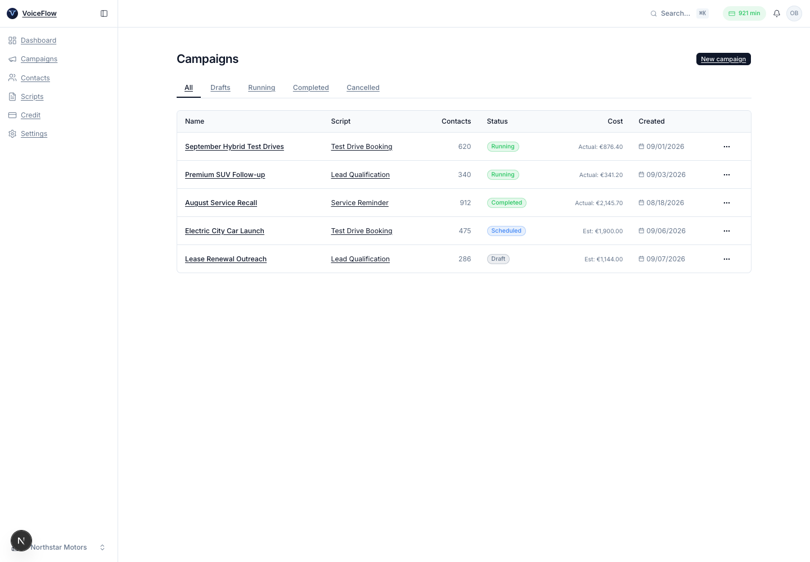
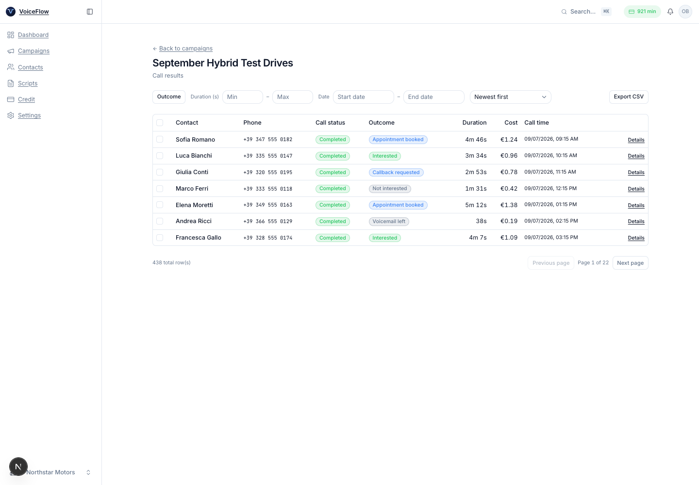
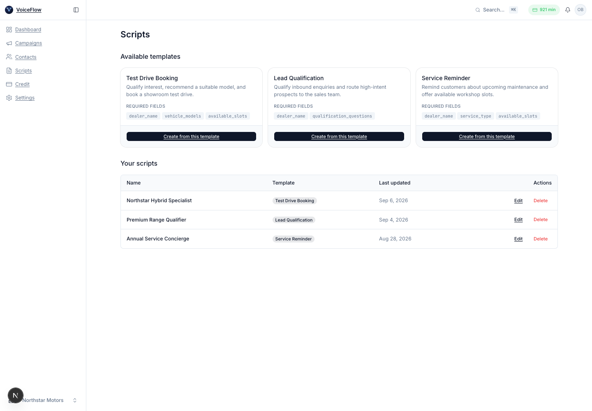
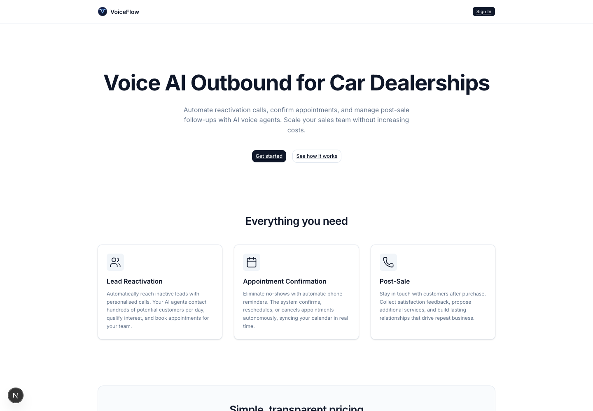

<p align="center">
  
</p>

# VoiceFlow — AI voice outreach for car dealerships

VoiceFlow is an outbound calling platform for automotive sales teams. It combines AI voice agents, contact and campaign management, appointment booking, usage-based billing, and campaign analytics in one application.

The platform is designed for the Italian market: it enforces local calling windows, supports opt-out and RPO compliance workflows, and can route calls through Italian phone numbers while giving operators a complete English or Italian interface.



## Reading guide

- [What VoiceFlow does](#what-voiceflow-does) — the core product workflows.
- [Product tour](#product-tour) — the main screens and how teams use them.
- [How a campaign works](#how-a-campaign-works) — the complete outbound-call journey.
- [Architecture](#architecture) — system boundaries, services, and data flow.
- [Getting started](#getting-started) — local setup and development commands.
- [Engineering documentation](#engineering-documentation) — detailed specifications and runbooks.

## What VoiceFlow does

VoiceFlow gives a dealership one place to:

- import and validate lead lists;
- filter contacts against opt-out and compliance controls;
- configure reusable AI calling scripts and voices;
- schedule and run concurrent outbound campaigns;
- monitor active calls and available credit;
- review call outcomes, costs, transcripts, and recordings;
- identify qualified leads and booked appointments;
- notify the sales team and forward results to external systems.

The application supports both **English and Italian**. Language and theme preferences are stored per user and can be changed from the account menu.

## Product tour

### Campaign operations

Campaigns move through draft, scheduled, running, paused, completed, or cancelled states. Each campaign connects a contact list to a versioned voice script and tracks both its estimated maximum cost and actual usage.



### Call results and analytics

Every call has an inspectable status and outcome. Operators can filter by outcome, duration, and date; sort by time or cost; export results; and open an individual call to review its media and transcript.



### Voice-agent scripts

Scripts are created from focused templates such as test-drive booking, lead qualification, and service reminders. Template variables keep the conversation reusable while each saved script remains versioned for reproducibility.



### Public experience

The marketing site explains the three primary dealership use cases: lead reactivation, appointment confirmation, and post-sale follow-up.



> The application screenshots use fictional dealership, campaign, contact, and usage data. No customer data is included.

## How a campaign works

1. An operator uploads a CSV lead list or sends contacts through an integration.
2. VoiceFlow validates phone numbers and applies opt-out and RPO eligibility rules.
3. The operator selects a voice script, fills its variables, chooses a schedule, and launches the campaign.
4. The platform reserves the maximum expected credit before dispatching any calls.
5. Inngest schedules the workload within the legal calling window and configured concurrency limit.
6. The voice provider runs each conversation and sends signed lifecycle webhooks back to VoiceFlow.
7. VoiceFlow stores the outcome and media references, reconciles the actual cost, and releases unused reserved credit.
8. Qualified leads and appointments appear on the dashboard and can trigger email or webhook notifications.

## Architecture

VoiceFlow is a modular Next.js application rather than a collection of independent microservices. The browser UI, server components, server actions, API routes, and webhook handlers share one TypeScript codebase. Long-running and scheduled work is delegated to managed providers.

```text
Browser
  │
  ▼
Next.js 16 application on Vercel
  ├── App Router UI and server actions
  ├── REST, cron, and signed webhook routes
  ├── authentication and organisation access control
  └── domain services: campaigns, contacts, credit, compliance
       │
       ├── Supabase Postgres, Auth, Storage, and Realtime
       ├── Inngest scheduling, fan-out, retries, and concurrency
       ├── Vapi / Retell voice orchestration
       │    └── Twilio / Telnyx telephony and Italian SBC routing
       ├── Stripe prepaid credit and payment webhooks
       ├── Resend transactional email
       └── Sentry, Axiom, and PostHog observability
```

### Architectural principles

- **Organisation isolation:** every tenant-owned row carries an `org_id`; Postgres RLS and request-scoped database contexts enforce isolation.
- **Prepaid execution:** campaigns reserve credit before launch and reconcile against actual billable seconds after each call.
- **Idempotent boundaries:** webhook events, credit entries, email dispatches, and scheduled work use stable keys so retries remain safe.
- **Compliance by design:** opt-out, RPO status, AI disclosure, consent, retention, audit, and legal-hold state are part of the core data model.
- **Versioned conversations:** a launched campaign points to a specific script version, so later edits cannot change an in-flight conversation.
- **Single-team operability:** managed infrastructure and a monolithic application keep deployment and incident response understandable.

### Main runtime flows

| Flow            | Path                                                                |
| --------------- | ------------------------------------------------------------------- |
| Authentication  | Browser → Supabase Auth → Next.js middleware → organisation context |
| Contact import  | CSV/API → validation → compliance checks → Postgres                 |
| Campaign launch | Server action → credit reservation → Inngest event                  |
| Outbound call   | Inngest → voice provider → carrier/SBC → customer                   |
| Call completion | Signed webhook → idempotent persistence → credit reconciliation     |
| Notifications   | Domain event → preference check → email or outbound webhook         |
| Reporting       | Postgres aggregates → dashboard, CSV export, and printable report   |

### Technology stack

| Layer                | Technology                                           |
| -------------------- | ---------------------------------------------------- |
| Application          | Next.js 16, React 19, TypeScript                     |
| UI                   | Tailwind CSS 4, shadcn/ui, Radix UI                  |
| Internationalisation | next-intl (`en`, `it`)                               |
| Data                 | PostgreSQL, Drizzle ORM, Supabase RLS                |
| Background work      | Inngest                                              |
| Voice and telephony  | Vapi or Retell, Twilio or Telnyx, ElevenLabs, OpenAI |
| Billing and email    | Stripe, Resend, React Email                          |
| Validation and forms | Zod, React Hook Form                                 |
| Testing              | Vitest, Testing Library, Playwright                  |
| Observability        | Sentry, Axiom, PostHog                               |

### Repository structure

```text
src/
  app/                  Next.js routes, layouts, server actions, and APIs
  components/           application and shadcn/ui components
  i18n/                 English and Italian message catalogues
  lib/
    auth/               request identity and capabilities
    db/                 Drizzle schema, migrations, seeds, and context
    services/           domain logic
    voice/              provider adapters and call persistence
    inngest/             scheduled and event-driven jobs
drizzle/migrations/     ordered PostgreSQL migrations
e2e/                    Playwright end-to-end and visual tests
docs/                   specifications, decisions, operations, and runbooks
infra/                  deployment and infrastructure configuration
```

## Getting started

### Prerequisites

- Node.js 20 LTS (see `.nvmrc`)
- pnpm 9.x through Corepack
- [Supabase CLI](https://supabase.com/docs/guides/local-development/cli/getting-started)
- Docker Desktop for the local Supabase stack

### Install and run

```bash
corepack enable
corepack prepare pnpm@9.15.4 --activate
pnpm install
supabase start
cp .env.local.example .env.local
pnpm db:migrate
pnpm db:seed
pnpm dev
```

Open [http://localhost:3000](http://localhost:3000).

`supabase status` prints the local URL and API keys needed in `.env.local`. The example file documents the remaining development placeholders. For cloud environments and key rotation, follow the [Supabase setup guide](docs/infra/supabase-setup.md).

### Environment variables

The minimum development configuration covers:

- the public application URL and environment name;
- pooled and direct PostgreSQL connections;
- Supabase URL, anonymous key, and service-role key;
- Stripe test keys and webhook secret;
- Resend sender configuration;
- Inngest event and signing keys;
- internal webhook, admin, and cron secrets.

See [`.env.example`](.env.example) for the authoritative production set, including voice providers, telephony, observability, and optional integrations. Never commit `.env.local` or real credentials.

### Common commands

| Command              | Purpose                                                         |
| -------------------- | --------------------------------------------------------------- |
| `pnpm dev`           | Start the development server                                    |
| `pnpm build`         | Create a production build                                       |
| `pnpm lint`          | Run ESLint                                                      |
| `pnpm typecheck`     | Check TypeScript without emitting files                         |
| `pnpm test`          | Run unit and integration tests                                  |
| `pnpm test:coverage` | Generate the Vitest coverage report                             |
| `pnpm test:e2e`      | Run Playwright end-to-end tests                                 |
| `pnpm db:generate`   | Generate a Drizzle migration                                    |
| `pnpm db:migrate`    | Apply database migrations                                       |
| `pnpm db:seed`       | Seed shared scripts, voices, phone numbers, and credit packages |
| `pnpm db:studio`     | Open Drizzle Studio                                             |

### Quality checks

Before opening a pull request, run:

```bash
pnpm format:check
pnpm lint
pnpm typecheck
pnpm test
pnpm build
```

Playwright visual baselines live in `e2e/__snapshots__/`. Update them only for intentional UI changes and inspect the generated diff before committing:

```bash
pnpm exec playwright test e2e/visual.spec.ts --project chromium --update-snapshots
pnpm exec playwright show-report
```

## Engineering documentation

The README contains the product and architecture overview. Detailed, operational, or fast-changing material stays in focused documents:

| Document                                               | Scope                                                                |
| ------------------------------------------------------ | -------------------------------------------------------------------- |
| [Technical specification](docs/technical_spec.md)      | Detailed architecture, data model, security, and integration design  |
| [Architecture decisions](docs/architecture-decisions/) | Durable decisions and their trade-offs                               |
| [Operations guide](docs/operations.md)                 | Production operation and service ownership                           |
| [Internationalisation](docs/i18n.md)                   | Locale routing, translations, and formatting                         |
| [Webhook reference](docs/webhooks.md)                  | Incoming and outgoing webhook contracts                              |
| [Integration roadmap](docs/integrations-roadmap.md)    | Planned external-system support                                      |
| [Supabase setup](docs/infra/supabase-setup.md)         | Local and hosted database configuration                              |
| [Runbooks](docs/runbooks/)                             | Incidents, recovery, credentials, compliance, and go-live procedures |
| [Implementation plan index](docs/plans/00-INDEX.md)    | Historical implementation plans and status                           |
| [Contributing](CONTRIBUTING.md)                        | Development workflow and repository conventions                      |

## CI status


## License

Proprietary — see [LICENSE](LICENSE).
